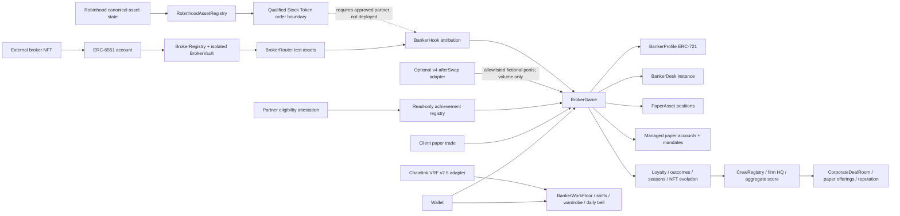

# Banker Bros: Wall Street District

Banker Bros is a playable, testnet-first Wall Street career RPG built on the ChainDesk League protocol foundation. Players now begin in a roaming 3D city, switch freely between third-person and first-person views, travel to workplaces, take programmable jobs, meet clients, grow AUM and reputation, and map meaningful game actions to onchain brokerage infrastructure. The original top-down pixel district remains available as a complete alternate game mode.

The vertical slice uses an original 16-bit/32-bit pixel-art-inspired visual language: a tile-based Wall Street overworld, expressive banker sprites, dialogue boxes, enterable interiors, a briefcase inventory, client quests, and turn-based brokerage negotiations. It is inspired by the warmth and clarity of classic handheld RPGs without copying characters, maps, sprites, music, logos, interface assets, or proprietary content from any existing game.

The default experience is deliberately **not** a securities platform: markets are fictional or crypto-test labels, positions are game inventory, prices are simulated, and credits have no cash value. Robinhood Stock Token compatibility now exists only as an optional qualified-order boundary; it is inactive without a separately approved eligibility and execution partner.

## Playable Wall Street vertical slice

- A new default 3D Wall Street career world with third-person and first-person cameras, block-by-block roaming, collision, moving traffic, and resident NPC bankers.
- A complete graphics remaster: cinematic 32-bit-inspired title art, session-aware sky and lighting, detailed façades, glowing windows, Exchange columns, a bronze bull landmark, animated banker rigs, modeled vehicles, street furniture, richer pixel materials, and glass-and-brass HUD styling.
- Eight data-driven city programs across the Exchange, bank, brokerage, coffee shop, subway, and simulated OTC zone; each program defines energy, cooldown, XP, reputation, commission, AUM, and optional chain intent.
- Glowing workplace markers, contextual work menus, career levels, energy, job titles, touch controls, and persistent career progress.
- Tile-based Wall Street overworld with collision, keyboard movement, and touch controls.
- Enterable Exchange, bank lobby, brokerage office, coffee shop, OTC alley, and subway placeholder.
- NPC bankers, clients, rivals, environmental inspection, dialogue, and interaction prompts.
- Three linked quests with item rewards and persistent progress.
- Finance-themed negotiation encounters using Tight Quote, Source Liquidity, Read the Tape, and Hedge Risk.
- Reputation, rank, commission, AUM, office level, briefcase inventory, and office upgrades.
- Market-open state derived from the local clock and a simulated live tape.
- Autosave plus manual save through browser local storage.
- A guided wallet flow for minting a dedicated Broker License NFT → ERC-6551 account → `BrokerRegistry` → isolated `BrokerVault` → test deposit → routed test order → `BankerHook` attribution → RPG progression.
- One-confirmation `Enter Wall Street` onboarding that mints and binds the Broker License atomically, plus automatic detection for returning license holders.
- A living Trading Hub with resident Exchange-floor brokers, a rotating district pulse, broker meetings, and a ladder driven by reputation, commission, AUM, and office growth.
- A Robinhood asset registry for canonical Stock Token UID, deployment, multiplier, active/halt, and freshness metadata, with direct vault routing prohibited for Stock Tokens.
- Existing wagmi wallet connection plus a read-only bridge for live BankerProfile identity, tower, office, credit, and desk state.
- Multiple banker profiles in one wallet can be selected from the Chain Desk.

Full slice notes and the game-to-chain event map are in [docs/WALL_STREET_VERTICAL_SLICE.md](docs/WALL_STREET_VERTICAL_SLICE.md).
The persistent-world architecture and rollout phases are in [docs/LIVE_WORLD_TRADING_HUB.md](docs/LIVE_WORLD_TRADING_HUB.md).
The 3D controls, workplaces, program schema, and expansion path are in [docs/3D_CITY.md](docs/3D_CITY.md).
The remastered art direction and procedural graphics system are in [docs/GRAPHICS_REMASTER.md](docs/GRAPHICS_REMASTER.md).

The contracts are unaudited and should remain on local networks or public testnets.

## What was learned from the reference product

The live [StonkBrokers](https://stonkbrokers.io/) experience uses a strong collectible-to-utility loop: acquire a broker NFT, inspect assets associated with its token-bound wallet, activate it into tier-weighted rewards, route protocol fees into a shared reward engine, and let the community trigger a distribution round. Its UI makes a complicated protocol legible with a persistent market/status tape, desk-like modules, numbered action sequences, visible fee splits, activity history, and progression tiers.

ChainDesk keeps those useful product patterns but uses an original design and a materially safer economy:

- Standard dynamic ERC-721 banker identity instead of experimental ERC-404 mechanics.
- Fictional `NOVA`, `QUANT`, `HELIOS`, and `ARCADE` markets instead of tokenized stocks.
- Non-transferable paper positions and valueless faucet credits instead of real securities or stablecoins.
- Commission, XP, tiers, and league score without loans, yield promises, gambling, or real-asset rewards.
- Testnet deployment guardrails, conspicuous disclosures, and demo mode before any wallet transaction.

A fuller product/UX extraction is in [docs/REFERENCE_ANALYSIS.md](docs/REFERENCE_ANALYSIS.md).

## MVP loop

1. Mint one of 1,000 banker profile NFTs for a small amount of **testnet ETH**.
2. Claim 100,000 play credits from the once-per-day faucet.
3. Stake 5,000 credits to deploy a lightweight banker desk contract.
4. Bankers publish an onchain strategy mandate with position, drawdown, and rebalance limits.
5. Clients allocate credits into isolated managed paper accounts or route their own paper trades.
6. The fixed 1% game fee funds banker commission, a 10% client loyalty rebate, protocol credits, and the season pool.
7. Concentration, cooldown, and drawdown guardrails are enforced on every managed buy.
8. Client outcomes, clients served, drawdown control, and managed activity determine seasonal score.
9. Season medals and eligible read-only achievements evolve the NFT's fully onchain metadata.
10. Season settlement moves the banker through ChainDesk Tower and writes the current floor, latest rank, and season into the NFT.
11. Ordinary promotions are capped at ten floors, inactive desks lose three floors, and the active rank-one banker occupies Floor 100.
12. Floor bands unlock higher office levels across terminal, research, and client-lounge tracks.
13. Office spending changes the room and NFT office rating but never buys outcome score.
14. Floor-21 bankers can form crews, invite up to twelve active profiles, appoint analysts and traders, and compete on aggregate outcomes.
15. A crew's headquarters floor is the average settled floor of its current roster.
16. Firms pitch for fictional corporate mandates during a bounded window; the pitch snapshots the roster.
17. Completed-season client outcomes determine the winning firm, which receives reputation and a non-transferable paper allocation.
18. Reputation plus headquarters quality unlock private executive access on Floors 70, 80, 90, and 100.
19. Active bankers clock into eight-hour assignments and build non-transferable dossiers, rolodexes, terminal modules, and deal blueprints.
20. A Chainlink VRF v2.5-compatible request determines each completed asset's quality and rarity without a reroll path.
21. Every banker gets one random cosmetic suit per UTC day; the best suit remains in their onchain wardrobe.
22. Shift quality and the daily suit feed a separate Closing Bell contest. The day's leader earns a permanent non-transferable trophy, but no client-outcome or tower advantage.
23. A connected wallet can display an external ERC-20 balance read-only. It never grants floor, score, transfer approval, or custody.
24. Transferring the profile NFT deactivates the desk until the new owner stakes to reactivate it.
25. The complete banker record follows the ERC-721 between wallets, while EIP-4906 events tell compatible NFT clients when rank or metadata changes.

Self-dealing is blocked, so a banker cannot farm their own profile by trading through their own desk.

## Architecture



### Contracts

| Contract | Role |
| --- | --- |
| `BankerProfile.sol` | Fixed-supply 1,000-token ERC-721 identity collection with dynamic SVG/JSON metadata, XP, season medals, achievements, tower position, and office rating. |
| `BrokerGame.sol` | Faucet, desk registry, paper trades, mandates, loyalty, outcomes, seasons, fee splits, tower settlement, and floor-gated office upgrades. |
| `CrewRegistry.sol` | Non-custodial firm registry with invitations, captain transfer, analyst/trader roles, twelve-profile rosters, average HQ floor, and aggregate outcome views. |
| `CorporateDealRoom.sol` | Competitive fictional corporate mandates with roster-snapshotted pitches, deterministic settlement, non-transferable paper allocations, firm reputation, and executive-floor access. |
| `BankerWorkFloor.sol` | Eight-hour banker shifts, non-transferable work assets, a once-daily suit wardrobe, and an activity-only Closing Bell competition. |
| `ChainlinkVrfV25Adapter.sol` | Subscription-based VRF v2.5-compatible request adapter with a storage-only coordinator callback and permissionless, retryable delivery. |
| `LocalRandomnessProvider.sol` | Explicit local-development mock. It must never be used as a public game oracle. |
| `BankerDesk.sol` | Per-profile onchain desk address whose owner always follows the profile NFT. It exposes no arbitrary execution in the MVP. |
| `PaperAsset.sol` | Fictional market registry and non-transferable player positions. Only the game can mint, burn, or update prices. |
| `BankerCommissionHook.sol` | Optional Uniswap v4 `afterSwap`-shaped adapter. It records capped volume only and must be restricted to allowlisted fictional pools. |
| `EligibilityRegistry.sol` | Time-bounded eligibility attestations from an approved partner; it performs no identity checks itself. |
| `ReadOnlyAchievementRegistry.sol` | Reads an allowlisted token balance after eligibility and records a badge. It has no transfer, approval, custody, or execution path. |
| `IQualifiedExecutionPartner.sol` | Future typed boundary for a licensed provider. No implementation is deployed. |
| `BrokerRegistry.sol` | Registers an externally owned broker NFT, resolves/creates its ERC-6551 account, deploys one isolated vault, and records AUM, volume, commission, and reputation. |
| `BrokerVault.sol` | NFT-controlled vault restricted to explicitly allowlisted six-decimal crypto/test assets; Stock Tokens cannot be deposited. |
| `BrokerRouter.sol` | Routes same-unit test swaps and exposes a separate non-custodial Stock Token order boundary with eligibility checks. |
| `BankerHook.sol` | Attributes direct test orders and verified qualified fills to broker progression; it does not execute swaps or custody assets. |
| `RobinhoodAssetRegistry.sol` | Stores canonical Stock Token UID, symbol, class, multiplier, active/halt state, and a one-hour default freshness limit. |
| `FaucetTestAsset.sol` | Valueless public-testnet faucet token used to exercise the complete deposit and routing loop. |
| `BrokerLicense.sol` | Dedicated 10,000-supply ERC-721 brokerage identity with one public testnet mint per wallet, fully onchain art, transfers, and dynamic ERC-6551/vault binding metadata. |

The frontend is a Vite/React RPG shell with wagmi, viem, injected-wallet support, optional WalletConnect, responsive keyboard/touch controls, and persistent local saves. `src/lib/rpg.ts` owns deterministic map, collision, quest, inventory, rank, and negotiation rules. `src/lib/onchainBroker.ts` performs safe read-only synchronization with the existing `BankerProfile` and `BrokerGame` deployments. The Chain Desk now also drives the external NFT/ERC-6551 testnet transaction sequence and writes a confirmed swap's commission, reputation, and retained-fee AUM into the RPG save.

### NFT portability and onchain rank

The collection has an immutable maximum supply of 1,000. NFTs are minted by players as they enter the game; deployment does not pre-mint the collection to the operator. The frontend reads the live total supply from the contract, displays the remaining banker passports, and disables minting when the cap is reached.

The banker identity is a standard transferable ERC-721. The handle, XP, simulated volume, achievements, medals, office rating, tower floor, latest rank, season, and wallet-transfer count are stored against the token ID, so they remain intact when the NFT moves to a new wallet. `tokenURI` returns fully onchain base64 JSON and SVG—there is no metadata server to lose or rewrite the record.

Wallet integration is automatic. The profile contract maintains ERC-721 enumerable ownership indexes, and the application reads every banker passport held by the connected wallet. It selects an owned profile on connection, presents a switcher when the wallet holds multiple bankers, refreshes the list after mint or transfer, and renders the selected token's actual onchain SVG rather than a separate offchain mock.

Every performance, achievement, season, tower, office, or ownership update emits the EIP-4906 `MetadataUpdate(tokenId)` event. Compatible wallets and indexers can use that signal to refresh the credential. Some wallet interfaces cache NFT art and may still require their own manual refresh.

The My Desk screen includes an owner-only safe-transfer console. After transfer, the former wallet immediately loses its rank badge, the desk tier becomes inactive through the existing transfer-nonce guard, and the receiving wallet must stake to reactivate the desk. This prevents an old owner from retaining commission authority while preserving the banker NFT's earned history.

### Tower settlement

`settleTowerFloor(seasonId, profileId, towerRank)` is an owner-only season operation intended for a transparent multisig or governed settlement service. The submitted league rank is paired with the score already recorded by the game:

- A desk must have served a client and managed capital to be active.
- Normal upward movement is capped at ten floors per season.
- Active rank-one bankers with a sufficient score take Floor 100.
- A replaced Floor 100 champion moves to Floor 99.
- Inactive desks lose three floors; other demotions are capped at five.
- A profile can be settled only once per season.

Every settlement emits an indexable event and updates both the game state and the NFT metadata in the same transaction.
Older seasons cannot be awarded or settled after a newer season for the same profile.

### Office progression

Each profile owns one persistent office with three tracks: terminal bank, research library, and client lounge. Tracks have five levels, with a new level unlocked every twenty tower floors. Upgrade costs are 2,000, 5,000, 10,000, 20,000, and 40,000 valueless credits. Spent credits flow to the valueless season pool.

Office rating is the sum of installed levels multiplied by 100 and is written to the dynamic NFT. It is deliberately excluded from `outcomeScore`; office spending cannot purchase rank, promotion, or performance points. The frontend client wire changes by floor division, but its briefs are prompts only—actual score still requires onchain managed-paper allocations and marked client outcomes.

### Crews and firms

`CrewRegistry` is deployed as a separate module so social features do not expand the core trading contract or receive execution authority. A captain must own an active profile on Floor 21 or higher to create a crew. Captains invite profiles; the invited profile owner must accept onchain. Each profile can belong to only one active crew, and a crew is capped at twelve profiles.

Roles are captain, trader, and analyst. Captains may transfer leadership but cannot abandon a populated crew. Headquarters floor is the integer average of current member floors, office rating is the sum of member office ratings, and firm season score is the sum of eligible member `outcomeScore` values. Inactive profiles score zero. A member's score counts only for seasons at or after their onchain join season, preventing late roster changes from backfilling historical results. The registry cannot trade, transfer credits, custody assets, or alter any member's underlying score.

### Corporate Deal Room

The separately deployed `CorporateDealRoom` lets the game operator open a fictional offering for the active season with a pitch deadline, minimum headquarters floor, optional minimum reputation, paper allocation, and reputation reward. A lead banker must own a profile in the pitching crew. One pitch snapshots up to twelve current members, preventing later roster changes from rewriting that deal's competing book.

After the season advances, anyone may finalize the offering. The contract deterministically compares the snapshotted members' completed-season outcome scores, then adds modest pre-pitch HQ and reputation bonuses. The winning firm receives only an onchain reputation number and a non-transferable paper-allocation record. No funds, securities, ownership rights, or transferable assets enter the module. Reputation and HQ requirements unlock private game access at Floors 70, 80, 90, and 100.

### Work Floor, daily suits, and the Closing Bell

`BankerWorkFloor` gives an active desk up to three shifts per UTC day. The banker chooses one of four assignments, and that choice is frozen at clock-in. After eight hours, finishing the shift creates a randomness request. Fulfillment produces quality from 40–100 and Standard, Uncommon, Rare, or Legendary rarity. The resulting desk asset cannot be transferred or sold.

Each active banker can also request exactly one suit per UTC day. The five tiers are Pinstripe Starter (55%), Power Suit (25%), Executive Cut (13%), Chairman Reserve (6%), and Wall Street Legend (1%). Six visual styles give each cut variation. The contract tracks the latest suit, personal best, tier collection, and total spins.

The daily Closing Bell score is deliberately separate from the client-outcome league. A shift adds `quality × rarity` and the suit adds `tier × 50`. The contract records the current leader as scores change. Once the UTC day ends, anyone can settle its winner; the rightful winning profile receives one trophy and 250 work-reputation points. Work reputation, suits, and trophies never enter `outcomeScore`, tower settlement, commissions, managed portfolios, or corporate pitch scoring.

## Repository layout

```text
.
├── apps/web/                    React + wagmi frontend
│   ├── src/components/          Wallet, disclaimer, and chart components
│   ├── src/lib/                 ABIs, chain config, and economy helpers
│   ├── public/assets/           Original Wall Street title art and game imagery
│   └── .env.example
├── contracts/
│   ├── src/                     Solidity contracts
│   ├── src/hooks/               Optional v4 hook-shaped adapter
│   ├── src/randomness/          VRF v2.5 adapter and local-only mock
│   ├── script/Deploy.s.sol      Testnet-guarded deployment
│   ├── script/DeployBrokerLiquidity.s.sol External NFT/ERC-6551 liquidity deployment
│   ├── script/DeployWorkFloor.s.sol  Optional randomness/work deployment
│   └── test/BrokerGame.t.sol    Foundry integration tests
├── docs/REFERENCE_ANALYSIS.md
├── docs/3D_CITY.md
├── docs/GRAPHICS_REMASTER.md
├── docs/LIVE_WORLD_TRADING_HUB.md
├── docs/ROBINHOOD_STOCK_TOKEN_INTEGRATION.md
├── .env.example
├── foundry.toml
└── package.json
```

## Prerequisites

- Node.js 20 or later
- npm 11 or later
- Foundry (`forge`, `anvil`, and `cast`)
- A browser wallet configured for Anvil, Base Sepolia, Ethereum Sepolia, or Robinhood Chain Testnet

## Install and verify

```bash
npm install
npm test
npm run build
```

The test command runs both Foundry contract tests and Vitest frontend economy tests.

## Run the frontend in demo mode

```bash
npm run dev
```

No contract address is required for demo mode. The interface remains interactive, but transaction buttons explain that a deployment address is needed.

## Local end-to-end deployment

Start a local chain in one terminal:

```bash
anvil
```

In another terminal, use one of the pre-funded private keys printed by Anvil:

```bash
export PRIVATE_KEY="<ANVIL_PRIVATE_KEY>"
export TREASURY="<ANVIL_ACCOUNT_ADDRESS>"
export PROFILE_MINT_FEE="1000000000000000"

forge script contracts/script/Deploy.s.sol:Deploy \
  --rpc-url http://127.0.0.1:8545 \
  --broadcast
```

Then deploy the local-only work provider and Work Floor using the addresses printed by the core deployment:

```bash
export PROFILE_ADDRESS="<BANKER_PROFILE_ADDRESS>"
export GAME_ADDRESS="<BROKER_GAME_ADDRESS>"

forge script contracts/script/DeployWorkFloor.s.sol:DeployWorkFloor \
  --rpc-url http://127.0.0.1:8545 \
  --broadcast
```

The local randomness provider is owner-fulfilled for deterministic development. It is conspicuously separate from the public VRF path and must never be deployed as a public oracle.

Copy the seven deployed addresses from the broadcast output into `apps/web/.env.local`:

```dotenv
VITE_CHAIN_ID=31337
VITE_RPC_URL=http://127.0.0.1:8545
VITE_GAME_ADDRESS=0x...
VITE_PROFILE_ADDRESS=0x...
VITE_PAPER_ASSET_ADDRESS=0x...
VITE_ACHIEVEMENT_ADDRESS=0x...
VITE_ELIGIBILITY_ADDRESS=0x...
VITE_CREW_ADDRESS=0x...
VITE_DEAL_ROOM_ADDRESS=0x...
VITE_WORK_FLOOR_ADDRESS=0x...
VITE_STONKBROKER_TOKEN_ADDRESS=0xe934e36A439C94017B64a3FecE66AF12099aBF50
VITE_BROKER_LICENSE_ADDRESS=0x...
VITE_BROKER_IDENTITY_NFT_ADDRESS=0x...
VITE_ERC6551_REGISTRY_ADDRESS=0x...
VITE_BROKER_REGISTRY_ADDRESS=0x...
VITE_BROKER_VAULT_ADDRESS=0x...
VITE_BROKER_ROUTER_ADDRESS=0x...
VITE_BANKER_HOOK_ADDRESS=0x...
VITE_PROFILE_MINT_FEE_ETH=0.001
VITE_WALLETCONNECT_PROJECT_ID=
```

Restart `npm run dev`, add Anvil to the wallet, import one of Anvil's disposable accounts, and use only its local test ETH.

## Base Sepolia deployment

Base Sepolia is the recommended public testnet path.

1. Create a fresh deployment wallet used only for testnet.
2. Fund it with Base Sepolia faucet ETH.
3. Copy `.env.example` to `.env` and fill `PRIVATE_KEY`, `TREASURY`, and `BASE_SEPOLIA_RPC_URL` locally. Never commit `.env`.
4. Simulate the deployment without `--broadcast` first.
5. Broadcast only after the simulation succeeds.

```bash
set -a
source .env
set +a

# Dry run
forge script contracts/script/Deploy.s.sol:Deploy \
  --rpc-url "$BASE_SEPOLIA_RPC_URL"

# Broadcast after reviewing the dry run
forge script contracts/script/Deploy.s.sol:Deploy \
  --rpc-url "$BASE_SEPOLIA_RPC_URL" \
  --broadcast
```

The script allows only Anvil (`31337`), Ethereum Sepolia (`11155111`), Base Sepolia (`84532`), and Robinhood Chain Testnet (`46630`) by default. `ALLOW_UNSAFE_CHAIN=true` bypasses that deployment-script guard and should not be used for this MVP. The game also records the deployment chain ID immutably and rejects a constructor mismatch.

After deployment, put the addresses in the frontend environment, build, and deploy the static `apps/web/dist` directory to a host of your choice:

```bash
npm run build
```

For WalletConnect QR support, create a project in Reown/WalletConnect, allowlist the final frontend origin, and set `VITE_WALLETCONNECT_PROJECT_ID`. Injected wallets work without it.

### GitHub Pages deployment

The repository includes a GitHub Pages workflow. Every push to the main branch validates the frontend, builds it with the correct repository base path, and publishes the web application.

After creating the GitHub repository:

1. Open **Settings → Pages** and choose **GitHub Actions** as the publishing source.
2. Add the public frontend configuration under **Settings → Secrets and variables → Actions → Variables**. Use the VITE-prefixed names from the environment example.
3. Do not add the deployment private key to the Pages workflow. Contract deployments remain a separate testnet-only operation.
4. Push to main or run **Deploy ChainDesk League** manually from the Actions tab.

With a repository named chaindesk-league under MetaMan999, the expected Pages address is https://metaman999.github.io/chaindesk-league/.

The application safely remains in demo mode until valid public testnet contract addresses are configured as repository variables.

### Chainlink VRF v2.5 Work Floor on Base Sepolia

Deploy the core contracts first. Then create and fund a VRF v2.5 subscription, and use Chainlink's published Base Sepolia values. At the time this repository was prepared, the official coordinator is `0x5C210eF41CD1a72de73bF76eC39637bB0d3d7BEE` and the published key hash is `0x9e1344a1247c8a1785d0a4681a27152bffdb43666ae5bf7d14d24a5efd44bf71`. Recheck the official supported-networks page before every deployment rather than trusting copied configuration.

```bash
export PROFILE_ADDRESS="<BANKER_PROFILE_ADDRESS>"
export GAME_ADDRESS="<BROKER_GAME_ADDRESS>"
export VRF_COORDINATOR="0x5C210eF41CD1a72de73bF76eC39637bB0d3d7BEE"
export VRF_KEY_HASH="0x9e1344a1247c8a1785d0a4681a27152bffdb43666ae5bf7d14d24a5efd44bf71"
export VRF_SUBSCRIPTION_ID="<YOUR_SUBSCRIPTION_ID>"
export VRF_REQUEST_CONFIRMATIONS=3
export VRF_CALLBACK_GAS_LIMIT=250000
export VRF_NATIVE_PAYMENT=false

# Dry run first
forge script contracts/script/DeployWorkFloor.s.sol:DeployWorkFloor \
  --rpc-url "$BASE_SEPOLIA_RPC_URL"

# Broadcast only after checking the simulation
forge script contracts/script/DeployWorkFloor.s.sol:DeployWorkFloor \
  --rpc-url "$BASE_SEPOLIA_RPC_URL" \
  --broadcast
```

Add the deployed adapter as an authorized consumer on the funded subscription. The coordinator callback only stores the word, so it cannot lose randomness because downstream game processing reverts. A permissionless second transaction calls `deliver(requestId)`; this can be automated by a keeper after `RandomnessStored` or called manually during MVP testing. There is no cancel, re-request, or reroll method.

The adapter mirrors the VRF v2.5 request ABI to keep the MVP dependency-light. Before a public production deployment, pin the exact official Chainlink contracts package for the target chain, replace the local declarations with official imports, compare the ABI and selectors, and obtain a security audit.

### Robinhood Chain testnet path

Robinhood Chain Testnet is available in the frontend and guarded deployment script with chain ID `46630`, RPC `https://rpc.testnet.chain.robinhood.com`, and explorer `https://explorer.testnet.chain.robinhood.com`. Set:

```dotenv
VITE_CHAIN_ID=46630
VITE_RPC_URL=https://rpc.testnet.chain.robinhood.com
```

Deploy the simulated core game first. Do not guess a VRF coordinator or reuse Base Sepolia's address. Deploy `BankerWorkFloor` on Robinhood Chain only after Chainlink publishes and you independently verify supported v2.5 coordinator, key-hash, funding, and confirmation settings for chain `46630`.

The verified [StonkBroker contract](https://robinhoodchain.blockscout.com/token/0xe934e36A439C94017B64a3FecE66AF12099aBF50), `0xe934e36A439C94017B64a3FecE66AF12099aBF50`, is an 18-decimal ERC-20 on Robinhood Chain mainnet, not an ERC-721. It is configured separately as `STONKBROKER_TOKEN_ADDRESS` for read-only ecosystem display and must never be supplied to the ERC-6551 identity field.

The NFT/ERC-6551 liquidity layer has a separate guarded deployment. Setting `BROKER_IDENTITY_NFT_ADDRESS` to the zero address deploys the included `BrokerLicense` on the current chain and uses it automatically. Supplying an external identity NFT remains supported, but it must be readable on the deployment chain; a cross-chain NFT requires an independently reviewed bridge or ownership attestation rather than pretending a remote `ownerOf` call is available.

```bash
export STONKBROKER_TOKEN_ADDRESS="0xe934e36A439C94017B64a3FecE66AF12099aBF50"
# Use the zero address to deploy the dedicated BrokerLicense automatically.
export BROKER_IDENTITY_NFT_ADDRESS="0x0000000000000000000000000000000000000000"
export BROKER_IDENTITY_NFT_CHAIN_ID=46630
export ERC6551_REGISTRY_ADDRESS=0x000000006551c19487814612e58FE06813775758
export ERC6551_ACCOUNT_IMPLEMENTATION="<REVIEWED_ACCOUNT_IMPLEMENTATION>"

# Dry run first
forge script contracts/script/DeployBrokerLiquidity.s.sol:DeployBrokerLiquidity \
  --rpc-url "$ROBINHOOD_TESTNET_RPC_URL"

# Broadcast only after checking every resolved address
forge script contracts/script/DeployBrokerLiquidity.s.sol:DeployBrokerLiquidity \
  --rpc-url "$ROBINHOOD_TESTNET_RPC_URL" \
  --broadcast
```

The script deploys the dedicated Broker License when no external identity NFT is supplied, plus `bbUSD` and `bbETH` faucet tokens for the direct game loop. It binds the license metadata view to `BrokerRegistry`. It does **not** register any Stock Token or configure a qualified execution partner. Put the emitted license, registry, router, hook, asset-registry, and test-token addresses into the corresponding `VITE_` variables, then use the RPG's Chain Desk to mint, bind, fund, and route the test order.

For Stock Tokens, synchronize only canonical contract addresses and UIDs from Robinhood's asset data, update multiplier/active/halt metadata through a controlled attestor, and keep state fresh. The router then accepts an order only if the asset is current and not halted and the configured partner confirms wallet eligibility. The partner settles externally and may report a fill for game attribution; Stock Tokens never enter `BrokerVault`.

Full integration and operational requirements are in [docs/ROBINHOOD_STOCK_TOKEN_INTEGRATION.md](docs/ROBINHOOD_STOCK_TOKEN_INTEGRATION.md).

## Managed portfolios and scoring

Managed accounts never custody real assets. A client's allocated credits and virtual positions are keyed by client wallet plus banker profile. Only the current banker profile owner can rebalance, and only within the published mandate. Clients may always withdraw uninvested paper-account cash, including after a season closes.

The minimum managed allocation is 100 play credits, which blocks dust accounts from counting as clients. The onchain outcome score combines positive marked P&L, clients served, drawdown stewardship, and managed activity. Raw commission does not directly increase outcome score. Managed allocations and trades stop at the advertised season deadline, so a delayed rollover cannot extend scoring. Checkpoints after the deadline may update withdrawable account state but cannot rewrite the closed season. Season awards update the NFT after the operator advances the season.

The default 1% game fee allocates 10% of the fee to client loyalty, 10% to protocol credits, 65–80% to the banker according to tier, and the remainder to the season reward pool. All amounts are valueless game credits.

## Read-only achievements

No stock-token program is active after deployment. To configure one, the owner must:

1. Appoint a qualified eligibility attestor in `EligibilityRegistry`.
2. Obtain a current, program-specific eligibility attestation for each claimant.
3. Allowlist the exact observed token and minimum balance in `ReadOnlyAchievementRegistry`.
4. Configure the frontend program identifier.

Claiming reads `balanceOf` and increments NFT achievement count. The registry cannot transfer, wrap, approve, trade, or custody the observed asset. This does not make an otherwise restricted stock token portable.

## Qualified execution boundary

`BrokerRouter.sol` implements the order boundary, while `IQualifiedExecutionPartner.sol` remains an interface only. No partner implementation or Stock Token is configured by deployment, so regulated execution remains disabled. Enabling it requires a named provider contract and documented eligibility, jurisdiction, disclosures, custody, execution, best-execution, settlement, corporate-action, complaint, surveillance, and reporting responsibilities. Do not replace this with a generic arbitrary-call router.

## Uniswap v4 integration boundary

`BankerCommissionHook.sol` mirrors the v4 `afterSwap` callback shape and exposes only an allowlisted, capped volume signal. It intentionally does **not** collect real swap fees or mint credits. Before using it with a particular v4 deployment:

1. Pin the exact official `v4-core` release used by that chain.
2. Replace the local type declarations with imports from that release and compare the compiled ABI.
3. Mine a CREATE2 hook address with the required `AFTER_SWAP` permission bit.
4. Allowlist only pools whose assets are explicitly fictional game tokens.
5. Set the adapter as `authorizedHook` in `BrokerGame`.
6. Add fork tests against the target `PoolManager` and obtain an independent audit.

Treat the included adapter as an integration boundary, not as a production-ready deployed hook.

## Safety and production checklist

- Keep all branded assets and company names fictional.
- Do not connect real stock tokens, equity wrappers, profit-sharing rights, stablecoin redemption, or offchain brokerage APIs without qualified legal counsel and compliant infrastructure.
- Do not imply that commissions, XP, NFTs, or reward-pool credits will appreciate or convert to money.
- Commission credits are internal ledger entries; `PaperAsset` positions cannot be transferred.
- Read-only achievements should reward education or observation, not real-asset trading volume or rapid turnover.
- Eligibility attestations expire and must come from a provider that actually performs the required checks.
- No qualified Stock Token execution partner is included or deployed.
- The market epoch uses manipulable block entropy because outcomes have no financial value. Never reuse it where randomness secures value.
- The faucet is intentionally sybilable and suitable only for a game/test environment.
- The contracts have not been audited. Run static analysis, fuzz and invariant tests, fork tests, access-control review, and an external audit before any broader release.
- Configure monitoring, a bug bounty, multisig ownership, and a documented incident process before handling anything of value.
- Obtain jurisdiction-specific legal review for consumer, gaming, financial-promotion, data, sanctions, and tax obligations.

Nothing in this repository is legal, financial, investment, or tax advice.
